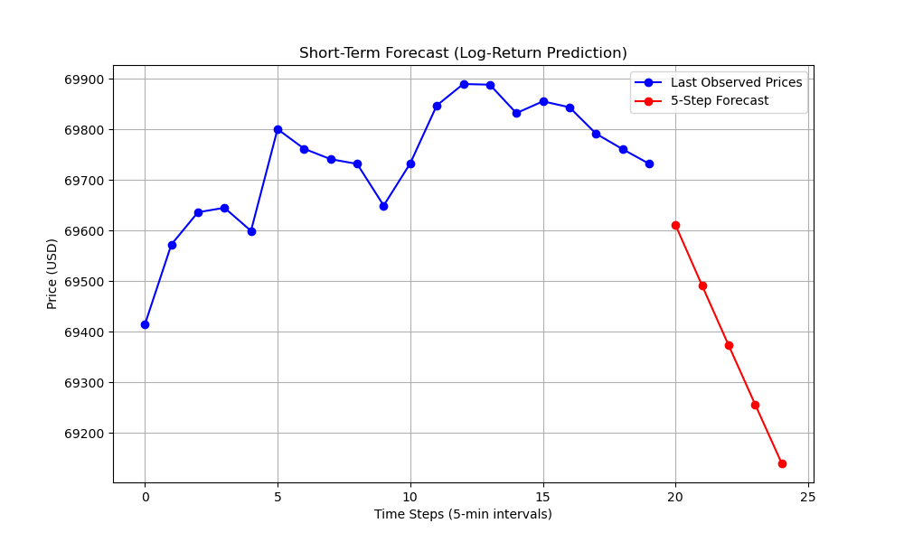

# Mathematical Roadmap to Deep Learning with Practical Financial Applications

## Overview

This project provides an **educational roadmap for deep learning models**, highlighting both their **mathematical foundations** and **practical applications** in financial and textual data analysis.

### Motivation

* **RNNs & Short-Term Bitcoin Forecasting:** Cryptocurrencies are highly volatile and nonlinear. RNN-based models effectively capture historical dependencies, supporting short-term trading and risk management strategies.
* **Transformer Models & Financial Sentiment Analysis:** Financial markets, including gold and interest rate indices, are influenced by investor expectations, macroeconomic news, and policy announcements.

### Objectives

* Present key deep learning models with their **mathematical formulations**.
* Demonstrate applications in **financial forecasting** and **sentiment analysis**.
* Compare model performance using standard evaluation metrics.

The project is divided into **two main modules**: time series forecasting and transformer-based sentiment analysis.

---

## PDF Documentation

* [Recurrent Neural Networks and Transformer-Encoder](doc/Recurrent_Neural_Networks_and_Transformer-encoder.pdf) – Includes step-by-step mathematical derivations, intuition, and examples.

---

## Experimentation Results

* [ResNet Gradient Flow](experimentation_result/gradient_flow.md) – Investigates how skip connections alleviate vanishing gradients.
* [RNN on Bitcoin](experimentation_result/RNN_Bitcoin.md) – Predicts short-term Bitcoin price movements using sequential models.
* [Financial Sentiment Analysis](experimentation_result/sentiment_analysis.md) – Evaluates document embeddings on gold and MOVE market indices.

---

## Part I: RNNs & Short-Term Bitcoin Forecasting

### Theoretical Roadmap

| Model               | Key Features                                 | Mathematical Insight                      |
| ------------------- | -------------------------------------------- | ----------------------------------------- |
| **MLP**             | Foundation of deep learning                  | $y = f(Wx + b)$                           |
| **Backpropagation** | Optimizes network via gradient descent       | Chain rule across layers                  |
| **RNN**             | Sequential dependencies                      | $h_t = σ(W_h h_{t-1} + W_x x_t + b)$      |
| **LSTM**            | Long-term dependency retention               | $c_t = f_t ⊙ c_{t-1} + i_t ⊙ \tilde{c}_t$ |
| **GRU**             | Simplified LSTM                              | Combined gates, fewer parameters          |
| **ResNet**          | Skip connections prevent vanishing gradients | $y = F(x, W_i) + x$                       |
| **ODE-RNN**         | Continuous-time sequence modeling            | $dh/dt = f(h, t)$                         |

**Focus:** Intuitive explanations, derivations, and a roadmap of knowledge for sequential modeling.

### Application

* **Goal:** Predict short-term Bitcoin log returns
* **Models:** LSTM, GRU, ODE-RNN
* **Input:** Historical Bitcoin prices
* **Evaluation:** RMSE, MAE, $R^2$

### Results

| Prediction                                                       | Forecast                                                       |
| ---------------------------------------------------------------- | -------------------------------------------------------------- |
|  |  |

**Observation:**
The ODE-RNN achieves strong statistical accuracy (low MSE/MAE, high R²). However, multi-step forecasts accumulate small negative log-return biases, producing monotonically decreasing price predictions. Future improvements could focus on bias correction or trend-aware multi-step forecasting.

---

## Part II: Transformer Models & Financial Sentiment Analysis

### Theoretical Roadmap

| Model                     | Key Features                          | Core Equation                                  |
| ------------------------- | ------------------------------------- | ---------------------------------------------- |
| **Transformer (Encoder)** | Self-attention, sequence dependencies | `Attention(Q,K,V) = softmax(Q^T K / √d_k) V`   |
| **BERT**                  | Pre-trained contextual embeddings     | Masked LM & Next Sentence Prediction           |
| **FinBERT**               | Domain-adapted BERT for finance       | Specialized embeddings for financial sentiment |

### Application

* **Goal:** Analyze sentiment in FOMC statements and impact on MOVE index returns.
* **Process:**

  1. Scrape documents (`scraper/`)
  2. Generate embeddings with `embedding.py`

     * **DocShift** – change in document sentiment
     * **IntraDocVar** – intra-document variability
     * **Hawkishness** – central bank tone indicator
  3. Perform Bayesian regression for short-term prediction

### Results

| Horizon | Model       | OOS Accuracy | Baseline Accuracy |
| ------- | ----------- | ------------ | ----------------- |
| 5-day   | Logistic_L2 | 0.7059       | 0.7059            |
| 5-day   | Logistic_L1 | 0.7059       | 0.7059            |
| 5-day   | LinearSVC   | 0.7059       | 0.7059            |
| 5-day   | GaussianNB  | 0.3529       | 0.7059            |
| 10-day  | Logistic_L2 | 0.8235       | 0.8235            |
| 10-day  | Logistic_L1 | 0.8235       | 0.8235            |
| 10-day  | LinearSVC   | 0.7647       | 0.8235            |
| 10-day  | GaussianNB  | 0.2941       | 0.8235            |

**Observation:**

* Logistic Regression and LinearSVC perform best for 10-day horizons.
* GaussianNB struggles due to correlated features.
* The analysis highlights that **FOMC statement metrics contain limited but measurable predictive signals** for short-term market movements.

---

## Python Scripts Overview

| Script                  | Purpose                                          |
| ----------------------- | ------------------------------------------------ |
| `GRU.py`                | GRU model for time series                        |
| `LSTM.py`               | LSTM model for time series                       |
| `ODERNN.py`             | Continuous-time sequence modeling                |
| `ResNet.py`             | Investigate skip connections & gradient issues   |
| `embedding.py`          | Generate document embeddings & sentiment metrics |
| `statement_analysis.py` | Predict short-term movements in MOVE or gold     |
| `main.py`               | Data scraping and preprocessing                  |

---

## Quick Start

### Install Dependencies

```bash
pip install -r requirements.txt
```

### Run Experiments

```bash
python src/models/RNN/main.py
python src/sentiment_analysis/statement_analysis.py
```

## References

- Chen, R. T. Q., Rubanova, Y., Bettencourt, J., Duvenaud, D. (2018). Neural ordinary differential equations. *NeurIPS*, 31.  
- Cho, K., van Merrienboer, B., Bahdanau, D., & Bengio, Y. (2014). Learning phrase representations using RNN encoder–decoder. *EMNLP*, 1724–1734.  
- Devlin, J., Chang, M.-W., Lee, K., & Toutanova, K. (2019). BERT: Pre-training of deep bidirectional transformers. *NAACL*, 4171–4186.  
- Elman, J. L. (1990). Finding structure in time. *Cognitive Science*, 14(2), 179–211.  
- He, K., Zhang, X., Ren, S., & Sun, J. (2016). Deep residual learning for image recognition. *CVPR*, 770–778.  
- Hochreiter, S., & Schmidhuber, J. (1997). Long short-term memory. *Neural Computation*, 9(8), 1735–1780.  
- Nielsen, M. A. (2015). *Neural networks and deep learning*. Determination Press.  
- Rubanova, Y., Chen, R. T. Q., & Duvenaud, D. K. (2019). Latent ODEs for irregularly-sampled time series. *NeurIPS*, 32.  
- Rumelhart, D. E., Hinton, G. E., & Williams, R. J. (1986). Learning representations by back-propagating errors. *Nature*, 323, 533–536.  
- Vaswani, A., Shazeer, N., Parmar, N., Uszkoreit, J., Jones, L., Gomez, A. N., Kaiser, Ł., & Polosukhin, I. (2017). Attention is all you need. *NeurIPS*, 30.  
- Werbos, P. J. (1990). Backpropagation through time: what it does and how to do it. *Proceedings of the IEEE*, 78(10), 1550–1560.  
- Schmidt, R. M. (2019). Recurrent neural networks: A gentle introduction. *arXiv:1912.05911*.  
- Turner, R. E. (2023). An introduction to transformers. *arXiv:2304.10557*.  
- init. (2020). Why BERT has 3 embedding layers. *Medium Blog*.  

Deep-Learning-Roadmap/
│
├── data/
│   ├── embedding/
│       ├── minutes.pkl
│       ├── projections.pkl
│       └── statements.pkl
│   └── raw/
│       ├── numerical/
|           ├── delta_t_tensor.pt
|           └── X_tensor.pt
│       ├── text/
|           ├── minutes
|           ├── statements
|           └── projections
├── docs/
|   └── Recurrent_Neural_Networks_and_Transformer-encoder.pdf
├── requirements.txt
├── src/
│   ├── models/
│       ├── RNN
│           ├── GRU.py
│           ├── LSTM.py
│           ├── ODERNN.py
│           └── main.py
│       └── ResNet.py
│   ├── scraper/
│       ├── scrapers
│       ├── untils
│       ├── main.py
│   └── sentiment_analysis/
│       ├── embedding.py
│       ├── statement_analysis.py
├── README.md
└── LICENSE
