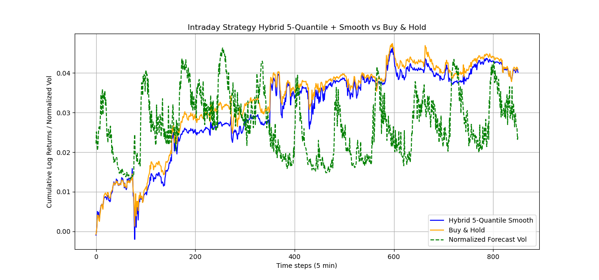
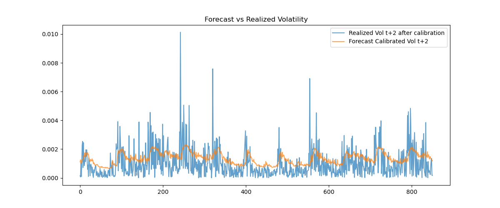

# **Deep Learning Mathematical Roadmap & Applications**

## Overview

This project provides an **roadmap for deep learning models**, highlighting both their **mathematical foundations** and **practical applications** in financial and textual data analysis.

### Motivation

* **RNNs & Short-Term Volatility Forecasting:** Financial markets exhibit volatility clustering, abrupt regime shifts, and heteroskedasticity. Traditional linear models such as `GARCH(1,1)` fail to capture intraday nonlinear dynamics. RNN-based models (`LSTM`, `GRU`, `ODE`) can learn temporal dependencies and incorporate multiple explanatory features to improve short-term volatility predictions for tactical allocation and risk management.
* **Transformer Models & Financial Sentiment Analysis:** Market behavior, including gold and interest rate indices, is sensitive to investor expectations, macroeconomic news, and policy announcements. Transformers provide efficient contextual embedding for textual analysis.

### Objectives

* Present key deep learning models with their **mathematical formulations**.
* Demonstrate applications in **financial volatility forecasting** and **sentiment analysis**.
* Compare model performance using standard evaluation metrics.

The project is divided into **two main modules**: time series forecasting and transformer-based sentiment analysis.

---

## PDF Documentation

* [Recurrent Neural Networks and Transformer-Encoder](doc/Recurrent_Neural_Networks_and_Transformer_encoder.pdf) – Includes step-by-step mathematical derivations, intuition, and examples.

---

## Experimentation Results

* [ResNet Gradient Flow](experimentation_result/gradient_flow.md) – Explores how skip connections mitigate vanishing gradients.
* [RNN on Nasdaq Volatility](experimentation_result/RNN_Nasdaq.md) – Predicts short-term Nasdaq intraday volatility using sequential models.
* [Financial Sentiment Analysis](experimentation_result/sentiment_analysis.md) – Evaluates document embeddings on gold and MOVE market indices.

---
## Application: Nasdaq Intraday Volatility Forecasting 

* **Goal:** Predict 5-minute ahead log variance of Nasdaq Composite returns ($t+2$ horizon).

* **Input Features:** Rolling realized volatility, high-low range, VIX, intraday returns, and derived volatility features.

* **Baseline:** GARCH(1,1) for comparison:
  $$\sigma_t^2 = \omega + \alpha , \epsilon_{t-1}^2 + \beta , \sigma_{t-1}^2$$
  Poor baseline metrics (MSE ≈ 347.55, R² ≈ –50.42) justify using RNN architectures.

* **LSTM** : notably outperforms the GARCH(1,1) baseline in both MSE = 0.86 and R² = 0.13, and is therefore selected as the core model for the subsequent volatility timing strategy.

---

### Volatility Timing Strategy

The calibrated forecast is translated into dynamic exposure via quantile-based leverage. Returns are shifted by $t+2$ to avoid look-ahead bias.

**Quantile-Based Leverage Rule:**

| Lowest 20% | 20–40% | 40–60% | 60–80% | Highest 20% |
| ---------- | ------ | ------ | ------ | ----------- |
| 1.5        | 1.3    | 1.0    | 0.7    | 0.6         |

* Low predicted volatility → higher leverage.
* High predicted volatility → reduced exposure.
* Smoothed over time: $w_t^{smooth} = \alpha w_t + (1-\alpha) w_{t-1}^{smooth}$ to reduce turnover.

### Performance Result

| Strategy                            | Sharpe | Sortino | Calmar | Volatility |
| ----------------------------------- | ------ | ------- | ------ | ---------- |
| Volatility Timing (Quantile+Smooth) | 0.3804 | 0.4882  | 0.2059 | 0.0097     |
| Buy & Hold                          | 0.4327 | 0.5741  | 0.2831 | 0.0086     |

| Strategy                                                       | Forecast                                                       |
| ---------------------------------------------------------------- | -------------------------------------------------------------- |
|  |  |

**Key Observations:**

* Buy & Hold dominates across risk-adjusted metrics.
* Volatility timing increases realized volatility slightly.
* Forecasting improves variance predictability but does **not** yield superior portfolio efficiency.
* The signal serves primarily as a **risk-scaling mechanism**, not alpha generation.
 
### Theoretical Roadmap

| Model               | Key Features                                 | Mathematical Insight                      |
| ------------------- | -------------------------------------------- | ----------------------------------------- |
| **MLP**             | Foundation of deep learning                  | $y = f(Wx + b)$                           |
| **Backpropagation** | Optimizes network via gradient descent       | Chain rule across layers                  |
| **RNN**             | Sequential dependencies                      | $h_t = σ(W_h h_{t-1} + W_x x_t + b)$      |
| **LSTM**            | Long-term dependency retention               | $c_t = f_t ⊙ c_{t-1} + i_t ⊙ \tilde{c}_t$ |
| **GRU**             | Simplified LSTM                              | Combined gates, fewer parameters          |
| **ResNet**          | Skip connections prevent vanishing gradients | $y = F(x, W_i) + x$                       |
| **ODE-RNN**         | Continuous-time sequence modeling            | $dh/dt = f(h, t)$                         |

**Focus:** Intuitive explanations, derivations, and a roadmap of knowledge for sequential modeling.

---
## Application : Transformer Models & Financial Sentiment 

* **Goal:** Quantify the short-term impact of FOMC statements and projections on MOVE Index and gold prices using hierarchical FinBERT embeddings. Focus is on **intra-month effects** rather than long-term forecasting.

* **Input Features:**

  * **Hawkishness:** Contractionary tone measured via FinBERT sentiment probabilities.
  * **Document Shift:** Cosine distance between consecutive document embeddings.
  * **Intra-document Variance:** Dispersion across paragraph embeddings.
  * **Temporal Deltas & Interactions:** First differences ($\Delta$) and interaction terms (e.g., D_Hawkishness × D_DocShift) to capture short-term dynamics.

* **Baseline:** Simple monthly averages of MOVE and gold prices without sentiment features. Shows weak correlation with market movements, justifying the hierarchical embedding approach.

* **Hierarchical Embedding Method:** Token → Chunk → Paragraph → Document mean pooling ensures robust representations of long texts exceeding BERT’s 512-token limit.

---
### Market Impact Analysis

* **Monthly Alignment:** Market indices aggregated to month-level averages, mid-month reference ±2 days to handle non-trading days.

* **Event Window Analysis:** ±5 days around FOMC releases to assess **immediate market reactions**.

* **Forward Stepwise OLS Regression:** Train/test split (80%,20%), Variables added based on p-value (`p < 0.05`), Focus on **current month market responses**.

### Performance Result

| Target      | Selected Sentiment Variables                                                                        | R²    |
| ----------- | --------------------------------------------------------------------------------------------------- | ----- |
| MOVE Index  | Projection_IntraDocVar, Statement_D_Hawkishness×D_DocShift, Statement_DocShift, Statement_IntraDocVar | 0.628 |
| Gold Prices | Projection_Hawkishness, Projection_IntraDocVar, Statement_Hawkishness                               | 0.408 |


| Target      | Impact Illustration                         |
| ----------- | ------------------------------------------- |
| MOVE Index  |  |
| Gold Prices |  |

### Key Observations

* **MOVE Index:** Strong response to intra-document variability and combined hawkishness × document shift changes. Reaction occurs **within announcement day**, confirming rapid sentiment transmission.
* **Gold Prices:** Moderate response, primarily to hawkish projections. Statement hawkishness has a negative short-term effect, reflecting risk-adjustment behavior.
* **Intra-month Analysis:** Cumulative returns around FOMC releases show **immediate effects**, validating the event-driven approach over monthly averaging.
* Hierarchical embeddings capture semantic nuances in long FOMC documents effectively.
* Sentiment variables explain significant short-term market variance, especially in interest-rate sensitive instruments.
* Supports **event-based risk monitoring** rather than traditional forecasting models.


### Theoretical Roadmap

| Model                     | Key Features                          | Core Equation                                  |
| ------------------------- | ------------------------------------- | ---------------------------------------------- |
| **Transformer (Encoder)** | Self-attention, sequence dependencies | `Attention(Q,K,V) = softmax(Q^T K / √d_k) V`   |
| **BERT**                  | Pre-trained contextual embeddings     | Masked LM & Next Sentence Prediction           |
| **FinBERT**               | Domain-adapted BERT for finance       | Specialized embeddings for financial sentiment |

---

---

## Python Scripts Overview

| Script                  | Purpose                                          |
| ----------------------- | ------------------------------------------------ |
| `GRU.py`                | GRU model for time series                        |
| `LSTM.py`               | LSTM model for time series                       |
| `ODERNN.py`             | Continuous-time sequence modeling                |
| `ResNet.py`             | Investigate skip connections & gradient issues   |
| `embedding.py`          | Generate document embeddings & sentiment metrics |
| `analysis.py` | Predict short-term movements in MOVE or gold     |
| `main.py`               | Data scraping and preprocessing                  |

---

## Quick Start

### Install Dependencies

```bash
pip install -r requirements.txt
```

### Run Experiments

```bash
python src/models/RNN/main.py
python src/sentiment_analysis/statement_analysis.py
```

## References

- Chen, R. T. Q., Rubanova, Y., Bettencourt, J., Duvenaud, D. (2018). Neural ordinary differential equations. *NeurIPS*, 31.  
- Cho, K., van Merrienboer, B., Bahdanau, D., & Bengio, Y. (2014). Learning phrase representations using RNN encoder–decoder. *EMNLP*, 1724–1734.  
- Devlin, J., Chang, M.-W., Lee, K., & Toutanova, K. (2019). BERT: Pre-training of deep bidirectional transformers. *NAACL*, 4171–4186.  
- Elman, J. L. (1990). Finding structure in time. *Cognitive Science*, 14(2), 179–211.  
- He, K., Zhang, X., Ren, S., & Sun, J. (2016). Deep residual learning for image recognition. *CVPR*, 770–778.  
- Hochreiter, S., & Schmidhuber, J. (1997). Long short-term memory. *Neural Computation*, 9(8), 1735–1780.  
- Nielsen, M. A. (2015). *Neural networks and deep learning*. Determination Press.  
- Rubanova, Y., Chen, R. T. Q., & Duvenaud, D. K. (2019). Latent ODEs for irregularly-sampled time series. *NeurIPS*, 32.  
- Rumelhart, D. E., Hinton, G. E., & Williams, R. J. (1986). Learning representations by back-propagating errors. *Nature*, 323, 533–536.  
- Vaswani, A., Shazeer, N., Parmar, N., Uszkoreit, J., Jones, L., Gomez, A. N., Kaiser, Ł., & Polosukhin, I. (2017). Attention is all you need. *NeurIPS*, 30.  
- Werbos, P. J. (1990). Backpropagation through time: what it does and how to do it. *Proceedings of the IEEE*, 78(10), 1550–1560.  
- Schmidt, R. M. (2019). Recurrent neural networks: A gentle introduction. *arXiv:1912.05911*.  
- Turner, R. E. (2023). An introduction to transformers. *arXiv:2304.10557*.  
- init. (2020). Why BERT has 3 embedding layers. *Medium Blog*.  
