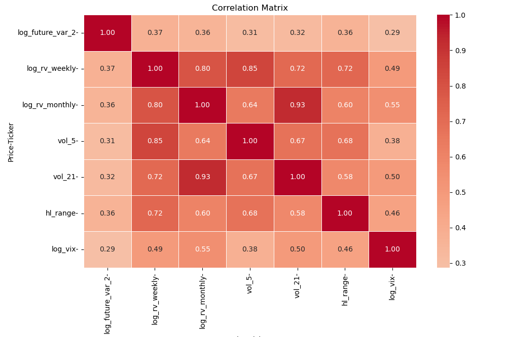
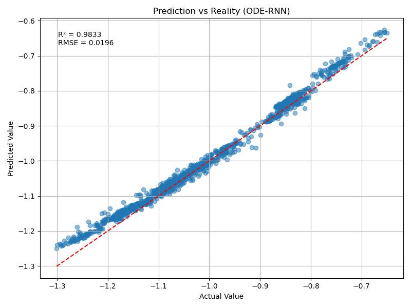
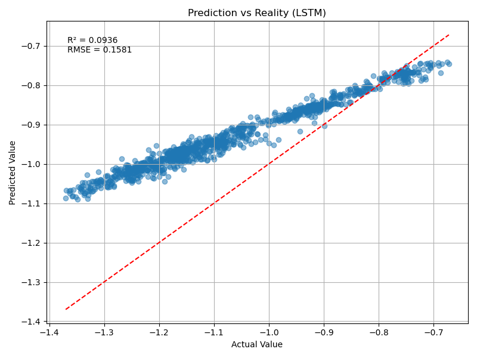
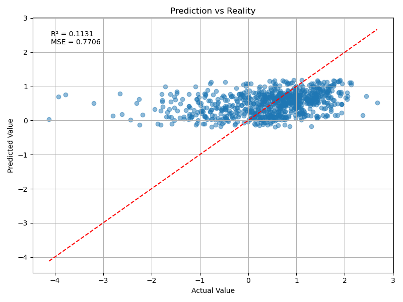
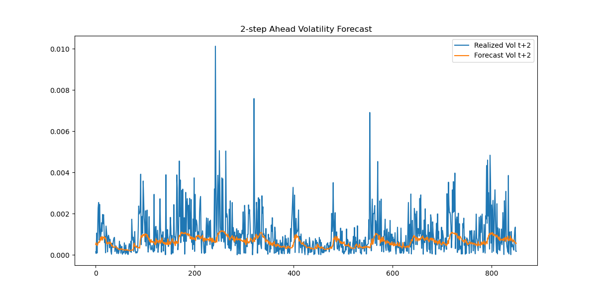

# **Short-Term Volatility Modeling of the Nasdaq**

---

Financial markets exhibit strong heteroskedasticity, volatility clustering, and abrupt regime shifts. The Nasdaq Composite Index is particularly sensitive to macroeconomic announcements, liquidity shocks, and changes in investor sentiment, which generate nonlinear and rapidly evolving volatility dynamics at intraday frequencies.

Traditional linear time-series models often struggle to capture short-horizon volatility dynamics when the data exhibit nonlinear dependencies and regime persistence. Recurrent neural networks (RNNs), such as LSTMs, GRUs ans ODEs, are well-suited for sequential modeling because their hidden states retain information from recent observations. By learning temporal dependencies across multiple explanatory variables, these architectures can model short-term volatility evolution and provide signals useful for risk management and tactical allocation decisions.

---

# A - Dataset and Target Construction

---

The dataset consists of **5-minute intraday data over the past 60 days** for the Nasdaq Composite Index (`^IXIC`), downloaded from Yahoo Finance.

Due to data availability constraints (Yahoo Finance limits intraday history to approximately 60 days), a 5-minute frequency was selected as a trade-off between:

* retaining sufficient temporal resolution,
* ensuring a usable sample size for model training,
* capturing intraday volatility structure.

## A.1 - 2-Step Horizon justification :

* Each step corresponds to 5 minutes, so ( t+2 ) represents a **10-minute forecasting horizon**.
* The horizon was selected empirically based on correlation analysis with candidate explanatory variables.
* Shorter horizons produced weaker explanatory structure.
* Longer horizons reduced statistical alignment under the limited 60-day sample constraint.

This choice is therefore partly data-driven and constrained by intraday data availability.

### A.1.1 - Target Variable

The prediction target is defined as:

`future_var_2` = $(\log r*{t+2})^2$

where: $\log r_t = \log\left(\frac{P_t}{P_{t-1}}\right)$

The final modeling target is:

`log_future_var_2` = $\log\left((\log r*{t+2})^2 + \varepsilon\right)$

where $\varepsilon$ is a small numerical constant for stability.

---

## A.2 - Feature Choice Justification



*Figure: Absolute correlation between candidate features and the target variable.*

Feature selection was initially guided by correlation analysis with the target. However, inclusion in the model is also supported by economic and statistical rationale.

### A.2.1 - Selected Features

**1. `log_rv_weekly`** : Log of rolling realized variance over short windows.
* Captures short-term volatility clustering.
* Reflects persistence effects consistent with ARCH-type behavior.

**2. `log_rv_monthly`** : Longer rolling realized variance.
* Captures slower-moving volatility regimes.
* Provides regime context (high-vol vs low-vol environments).

**3. `vol_5`** : Short-term rolling standard deviation.
* Sensitive to immediate volatility shocks.
* Enhances model reactivity to sudden intraday movements.

**4. `vol_21`** : Medium-term rolling volatility.
* Smooths microstructure noise.
* Helps capture intermediate persistence.

**5. `hl_range`** : High–low range normalized by price:
* Proxy for intraperiod volatility.
* Related to range-based estimators (e.g., Parkinson volatility).

**6. `log_vix`** : Log of VIX index level.
* Forward-looking implied volatility measure.
* Incorporates market expectations about future risk.
* Provides cross-market information external to realized Nasdaq returns.

## A.3 - Baseline Model 

Financial markets exhibit volatility clustering, heteroskedasticity, and abrupt regime shifts, especially at intraday frequencies. A natural baseline for modeling conditional variance is the `GARCH(1,1)` model, defined as:

$$\sigma_t^2 = \omega + \alpha , \epsilon_{t-1}^2 + \beta , \sigma_{t-1}^2$$

where $\epsilon_{t-1}$ is the previous return shock and $\sigma_{t-1}^2$ is the previous conditional variance. This captures volatility persistence using past squared returns and past variance.

Fitting a `GARCH(1,1)` to intraday log returns yields poor predictive performance (MSE ≈ 8.092726 , R² ≈ -0.3279), highlighting its limitations for short-horizon forecasts.

This motivates the use of **RNN architectures** (LSTM, GRU, ODE-RNN), which can model nonlinear temporal dependencies and leverage multiple explanatory variables to improve intraday volatility predictions.

  
---

# B - Python modelisation

This section describes the implementation of **LSTM**, **GRU**, and **ODE-RNN** architectures in PyTorch and the associated training procedure.

---
## B.1 - Hyperparameters

* **BATCH_SIZE = 32**
  Number of sequences processed simultaneously. Smaller batches introduce gradient noise that may improve generalization under limited data.

* **SEQ_LEN = 100**
  Each input sequence contains 20 time steps (100 minutes of history).

* **HIDDEN_DIM = 128**
  Size of the hidden state vector controlling model capacity.

* **NUM_LAYERS = 4**
  Stacked recurrent layers to capture hierarchical temporal patterns.

* **DROPOUT**
  Regularization mechanism to mitigate overfitting.

* **GRAD_CLIP = 1.0**
  Prevents exploding gradients during backpropagation.

* **EPOCHS = 50**
  Training duration under data constraints.

* **HORIZON = 2**
  Forecasting horizon corresponding to 10 minutes ahead.

---

## B.2 - Loss Function & Backpropagation

The regression task predicts:

$y_i$ = `log_future_var_2`

from the input sequence $x_{1:T}^{(i)}$.

Instead of Mean Squared Error, the **Huber Loss** is used for robustness to extreme volatility spikes.

The Huber loss is defined as:

$$
\mathcal{L}_\delta(y, \hat{y}) =
\begin{cases}
\frac{1}{2}(y - \hat{y})^2 & \text{if } |y - \hat{y}| \le \delta \
\delta \left(|y - \hat{y}| - \frac{1}{2}\delta\right) & \text{otherwise}
\end{cases}
$$

Where:

* $\delta$ controls the transition between quadratic and linear penalization.
* Small errors are treated like MSE.
* Large errors are penalized linearly, reducing sensitivity to outliers.

In PyTorch, this corresponds to:

```python
criterion = nn.HuberLoss(delta=1.0)
```
The model is trained via backpropagation through time (BPTT) using the Adam optimizer.

```python
loss = criterion(y_pred, y_batch)
loss.backward()
optimizer.step()
```
Gradient clipping is applied to prevent exploding gradients:

```python
torch.nn.utils.clip_grad_norm_(model.parameters(), GRAD_CLIP)
```

## B.3 - LSTM
An LSTM maintains two state variables at each time step: a hidden state $h_t ∈ ℝ^h$ and a memory cell $c_t ∈ ℝ^h$. The memory cell stores information additively over time, while gates control how information is written, erased, and read.

Given input $x_t ∈ ℝ^d$, the LSTM update equations are:

$$
\begin{align}
i_t &= \phi(W_{xi} x_t + W_{hi} h_{t-1} + b_i) && \text{(input gate)} \\
f_t &= \phi(W_{xf} x_t + W_{hf} h_{t-1} + b_f) && \text{(forget gate)} \\
o_t &= \phi(W_{xo} x_t + W_{ho} h_{t-1} + b_o) && \text{(output gate)} \\
\tilde{c}_t &= \tanh(W_{xc} x_t + W_{hc} h_{t-1} + b_c) && \text{(candidate cell state)} \\
c_t &= f_t \odot c_{t-1} + i_t \odot \tilde{c}_t && \text{(cell update)} \\
h_t &= o_t \odot \tanh(c_t) && \text{(hidden state)}
\end{align}
$$

All weight matrices $W_{x*} ∈ ℝ^{h×d}$, $W_{h*} ∈ ℝ^{h×h}$, and biases $b_* ∈ ℝ^h$ are learnable parameters. The sigmoid function $\phi(·)$ ensures gate activations lie in $(0,1)$.

Python’s `nn.LSTM` module handles the hidden and cell state updates internally. The last hidden state of the final layer is passed through a fully connected layer to produce the final prediction:


```python
out, (h_n, c_n) = lstm(x)
final_hidden = h_n[-1]          # last layer's hidden state
y_pred = fc(final_hidden)
```
Each input sequence is processed time step by time step, and the final hidden state summarizes the temporal information for prediction.

## B.4 - GRU

A GRU maintains a single hidden state $h_t ∈ ℝ^h$. Given input $x_t ∈ ℝ^d$, the GRU update equations are:

$$
\begin{align}
z_t &= \phi(W_{xz} x_t + W_{hz} h_{t-1} + b_z) && \text{(update gate)} \\
r_t &= \phi(W_{xr} x_t + W_{hr} h_{t-1} + b_r) && \text{(reset gate)} \\
\tilde{h}_t &= \tanh(W_{xh} x_t + W_{hh} (r_t \odot h_{t-1}) + b_h) && \text{(candidate state)} \\
h_t &= (1 - z_t) \odot h_{t-1} + z_t \odot \tilde{h}_t && \text{(state update)}
\end{align}
$$

All parameters are learnable, with weight matrices $W_{x*} ∈ ℝ^{h×d}$ and $W_{h*} ∈ ℝ^{h×h}$.

Python’s `nn.GRU` module handles these gates, and the final hidden state is again passed to a linear layer:

```python
out, h_n = gru(x)
final_hidden = h_n[-1]      
y_pred = fc(final_hidden)
```

Like LSTM, the GRU processes each sequence step by step. The update and reset gates control how information is retained or overwritten, making the model effective for long sequences with fewer parameters than LSTM.

## B.5 - ODE-RNN

- **Continuous dynamics:** Between observations $t_{i-1}$ and $t_i$, the hidden state $h(t) ∈ ℝ^h$ evolves according to an ODE:

$$\begin{equation}
\frac{d h(t)}{dt} = f_\theta(h(t)), \quad t \in (t_{i-1}, t_i)
\end{equation}$$

where $f_\theta$ is a neural network defining latent dynamics.

- **ODE solution:** The hidden state before the next observation is obtained via:

$$\begin{equation}
h'_i = \text{ODESolve}(f_\theta, h_{i-1}, t_{i-1}, t_i)
\end{equation}$$


- **Discrete update:** At observation $t_i$, the hidden state incorporates the new input $x_i$ through a recurrent cell:

$$\begin{equation}
h_i = \text{RNNCell}(h'_i, x_i)
\end{equation}$$

This allows the model to combine continuous-time dynamics with discrete-time observations.


ODE-RNNs combine continuous-time latent dynamics with discrete updates.

- **delta_t:** Time gaps between observations; used to integrate hidden states continuously.  
- **RK4 Solver:** Runge-Kutta 4 is a high-order method for approximating ODE solutions, improving accuracy over simple Euler integration.

Between observations, the hidden state evolves according to an ODE:

$$\begin{equation}
\frac{d h(t)}{d t} = f_\theta(h(t))
\end{equation}$$

At observation times, the hidden state is updated via the GRUCell : 

```python
for t in range(seq_len):
    if t > 0:
        h = odeint(lambda t, h: self.odefunc(h),h,self.integration_time.to(x.device),method="rk4")[1]
    h = self.rnn_cell(x[:, t], h)
residual = self.decoder(h).squeeze() 
last_return = x[:, -1, 0]
```
`torchdiffeq.odeint` solves the ODE for the latent state, and `GRUCell` applies the discrete update. This allows ODE-RNNs to handle irregularly sampled data and capture continuous-time dynamics more naturally than standard RNNs.

## B.5 Summary

- **LSTM:** explicit memory cell with controlled gradient flow via input, forget, and output gates.
- **GRU:** simpler architecture with single hidden state, still capable of long-term dependency modeling.
- **ODE-RNN:** continuous-time latent dynamics between observations, discrete updates via RNN cells, suitable for irregular time series.

## B.7 - Results and Prediction

The table below summarizes the performance metrics for the three models on the Nasdaq volatility prediction task. Metrics include MSE, RMSE, MAE, and R².

| Model    | MSE     | RMSE    | MAE     | R²      |
|----------|---------|---------|---------|---------|
| ODE-RNN  | 0.7728  | 0.8791  | 0.6548  | 0.1106  |
| GRU      | 0.7706  | 0.8778  | 0.6544  | 0.1131  |
| LSTM     | 0.7519  | 0.8671  | 0.6473  | 0.1346  |

### B.7.1 - Predictions vs True Values

The plots below show predicted versus true volatility forecast $t+2$ values for each model.

| ODE-RNN | LSTM | GRU |
|---------|------|-----|
|  |  |  |

*Figure: Comparison of predicted vs true Nasdaq volatility forecast for ODE-RNN, LSTM, and GRU models.*

All three models clearly outperform the baseline model `GARCH(1,1)`.

However, performance differences are consistent:

* **LSTM achieves the lowest error metrics (MSE, RMSE, MAE).**
* It explains the largest fraction of variance (highest R²).
* It exhibits the strongest correlation with realized volatility.
  
---

**For volatility forecast exploitation, LSTM is the preferred model.** 
  
---

# C - Forecast Evaluation and Potential Exploitation

This section explains how the volatility forecasts are evaluated, calibrated, and translated into a volatility timing strategy. Both the mathematical reasoning and the intuition behind each step are presented.

---
## C.1 - Denormalization

During training, the target variable was standardized:

$$y^{\text{scaled}} = \frac{y - \mu}{\sigma}$$

To interpret predictions in the original scale, we reverse the transformation:

$$\hat{y} = y^{\text{scaled}} \cdot \sigma + \mu$$

This restores the predicted **log future variance**:

```python
y_true_denorm = y_true * y_std.item() + y_mean.item()
y_pred_denorm = y_preds * y_std.item() + y_mean.item()
```

---

## C.2 - From Log-Variance to Variance and Volatility

The model predicts:

$$\hat{y}*t = \log(\sigma*{t+2}^2)$$

To obtain the variance forecast:

$$\hat{\sigma}_{t+2}^2 = \exp(\hat{y}_t)$$

And the volatility forecast:

$$\hat{\sigma}*{t+2} = \sqrt{\hat{\sigma}*{t+2}^2}$$

```python
var_true = np.exp(y_true_denorm)
var_pred = np.exp(y_pred_denorm)
vol_pred = np.sqrt(var_pred)
```



---

## C.3 - Forecast Quality: QLIKE Loss 

Quasi-likelihood estimation is one way of allowing for overdispersion, that is, greater variability in the data than would be expected from the statistical model used.

* The primary evaluation metric is **QLIKE**, defined as:

`QLIKE` = $\mathbb{E}\left[
\frac{\sigma_t^2}{\hat{\sigma}_t^2}\log\left(\frac{\sigma_t^2}{\hat{\sigma}_t^2}\right) - 1\right]$

Before calibration:

```
QLIKE = 3.9198
```

This indicates that the model captures structure but is miscalibrated in magnitude.

---

## C.4 - Mincer–Zarnowitz Calibration

To correct scale bias, we run the regression:

$$\sigma_t^2 = \alpha + \beta \hat{\sigma}_t^2 + \varepsilon_t$$

If forecasts are unbiased and efficient:

$$\alpha = 0, \quad \beta = 1$$

Estimated:

$$\alpha \approx 3.0 \times 10^{-7}, \quad \beta \approx 3.65$$

Since $\beta > 1$, the model systematically underestimates variance magnitude.

Calibrated forecasts:

$$\hat{\sigma}_{t,\text{cal}}^2 = \alpha + \beta \hat{\sigma}_t^2$$

After calibration:

```
QLIKE = 1.6145
```
Calibration dramatically improves forecast efficiency by correcting scale distortion.

Post-calibration metrics:
* QLIKE: 1.6145
* Correlation: 0.206

This confirms the model contains exploitable information but requires rescaling.


---
# D - Volatility Timing Strategy

The calibrated variance forecast is converted into a forward-looking volatility estimate and mapped into dynamic exposure.  
Since the model predicts $t+2$, realized returns are shifted accordingly to eliminate look-ahead bias: $r_{t+2}$

---

## D.1 - Forecast Transformation & Horizon Alignment

The calibrated conditional variance $\$hat{\sigma}^2_{t+2}$ is transformed into volatility:$\hat{\sigma}_{t+2} = \sqrt{\hat{\sigma}^2_{t+2}}$

This produces a tradable forward-looking risk signal.

---

Because forecasts target $t+2$, returns are aligned to ensure that exposure at time $t$ only uses information available at that date. This prevents forward information leakage.

---

## D.2 - Quantile-Based Allocation Rule

Predicted volatility is ranked into empirical quantiles and mapped into bounded leverage weights:

| Lowest 20% | 20–40% | 40–60% | 60–80% | Highest 20% |
|------------|--------|--------|--------|-------------|
| 1.5        | 1.3    | 1.0    | 0.7    | 0.6         |

Allocation logic:

- Low forecast volatility → increased exposure  
- High forecast volatility → reduced exposure  
- Monotonic and capped structure → controls instability  

To reduce turnover, weights are smoothed:$w_t^{smooth} = \alpha w_t + (1-\alpha) w_{t-1}^{smooth}$

---

## D.3 - Strategy Returns & Overall Assessment results

Strategy performance is computed as: $R_t^{strategy} = w_t \cdot r_t$

Annualization assumes 78 intraday periods per trading day.

| Strategy                              | Sharpe | Sortino | Calmar | Volatility |
| ------------------------------------- | ------ | ------- | ------ | ---------- |
| Volatility Timing (Quantile + Smooth) | 0.3804 | 0.4882  | 0.2059 | 0.0097     |
| Buy & Hold                            | 0.4327 | 0.5741  | 0.2831 | 0.0086     |


### D.3.1 - Observations & Discussions: 

* Buy & Hold strategie : betting that the asset’s long-term value will increase, and are ignoring short-term volatility.
* Buy & Hold dominates across all risk-adjusted metrics while exhibiting lower realized volatility.
* The signal functions primarily as a risk-scaling mechanism rather than a source of alpha.
---
The lower Sharpe (0.38 vs 0.43) indicates inferior return per unit of total volatility.
Although exposure is reduced in high-vol regimes, the strategy sacrifices upside participation without achieving sufficient risk reduction.

---
The weaker Sortino (0.49 vs 0.57) suggests that downside risk is not materially improved.
The volatility forecast captures dispersion, but not necessarily asymmetric negative returns or crash episodes.

---
The lower Calmar (0.21 vs 0.28) implies that maximum drawdowns are not effectively mitigated.
If volatility timing were economically powerful, one would expect a clear improvement in drawdown-adjusted performance. This is not observed.
