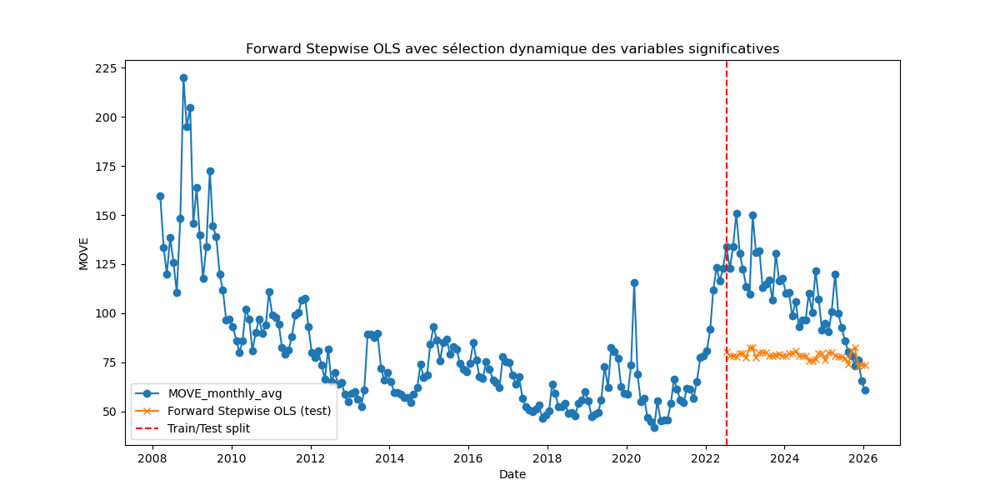
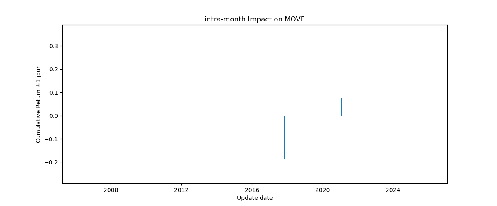
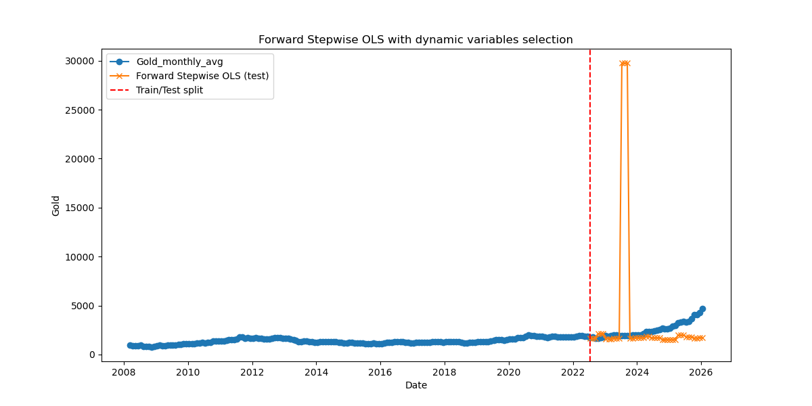
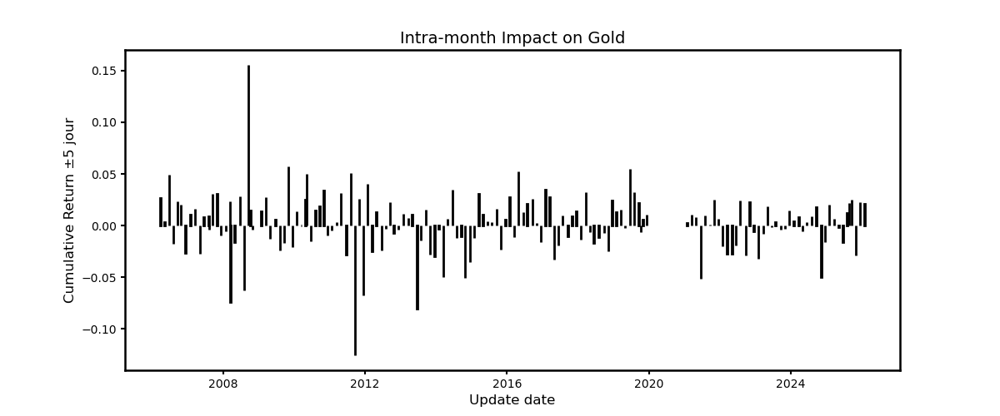

<h1 align="center" style="background:#00008B; color:white; padding:20px; border-radius:12px;">
Sentiment Analysis with FinBERT
</h1>

This application evaluates whether textual sentiment features extracted from FOMC communications contain economically meaningful information for financial markets. The analysis focuses on two market indicators that are directly sensitive to monetary policy expectations: the MOVE Index and gold prices.

Rather than constructing a long-horizon forecasting model, the objective is to measure the contemporaneous and intra-month informational impact of policy language on market variables.

## A - Embeding techniques 

### A.1 – FOMC Origin, Role, and Data Collection

The Federal Open Market Committee (FOMC) is the monetary policy–setting body of the Federal Reserve System. It is responsible for determining the target range for the federal funds rate and for guiding open market operations. Through its post-meeting statements and quarterly projections, the FOMC communicates its assessment of macroeconomic conditions, inflation dynamics, labor market developments, and future policy intentions.

FOMC communications are particularly relevant for financial markets because they shape expectations regarding:

* The path of short-term interest rates
* Inflation and real yield trajectories
* Liquidity conditions and balance sheet policy

Market participants closely analyze changes in tone, wording, and forward guidance, as even subtle shifts may signal adjustments in policy stance. Consequently, FOMC documents constitute a high-information textual corpus for studying monetary policy transmission and market reactions.

Documents are sourced from official FOMC releases:

* **FOMC Statements** – Published after each scheduled meeting (approximately eight per year).
* **Summary of Economic Projections (SEP)** – Released quarterly, providing forecasts for GDP growth, unemployment, inflation, and the federal funds rate.

For each document, structured metadata is retained:

* Publication date
* Meeting date
* Document type (Statement or SEP)
* File path to raw text

Data extraction and preprocessing are performed programmatically via a dedicated web-scraping pipeline (`src/scrapper/main.py`, which orchestrates all scraping modules), ensuring reproducibility, version control, and consistent text normalization for downstream embedding and sentiment analysis.


### A.2 - Hierarchical Embedding of Financial Texts

Financial policy documents such as FOMC statements and projections often exceed BERT’s maximum input length of **512 tokens**. To handle this, the new approach applies hierarchical mean pooling over paragraphs and chunks rather than simple contiguous chunking.

#### A.2.1 - Paragraph-level processing**

1. Documents are split into paragraphs using double newline separators. Empty paragraphs are ignored.
2. Each paragraph is tokenized without truncation and processed in **reverse sliding windows** of up to 512 tokens.
3. Token-level embeddings are computed with FinBERT and **mean-pooled** to produce a fixed-size vector for each chunk.
4. Chunk vectors within a paragraph are mean-pooled to obtain the **paragraph embedding**:

$$
\mathbf{v}*\text{paragraph} = \frac{1}{N*\text{chunks}} \sum_{i=1}^{N_\text{chunks}} \mathbf{v}_{\text{chunk},i}
$$

#### A.2.2 - Document-level embedding

Document embeddings are computed by averaging all paragraph embeddings:

$$
\mathbf{v}*\text{doc} = \frac{1}{N*\text{paragraphs}} \sum_{i=1}^{N_\text{paragraphs}} \mathbf{v}_{\text{paragraph},i}
$$

The **intra-document variance** is calculated as the mean of variances across paragraph embeddings:

$$
\sigma^2_\text{intra-doc} = \frac{1}{D} \sum_{i=1}^{D} \text{Var}(\mathbf{v}_{\text{paragraph},i})
$$

This hierarchical pooling ensures robust embeddings that capture the semantic structure of long financial texts.

---
### A.3 Sentiment Metrics 
From each FOMC document (Statements and Projections), three primary features are extracted:

1. **Hawkishness**
   Measures contractionary tone intensity:
   
   1. Each paragraph is tokenized and split into chunks of 512 tokens.
   2. Each chunk is processed with FinBERT’s classification head, producing probabilities for `positive`, `neutral`, and `negative` sentiment.
   3. The **chunk-level hawkishness score** is computed as:

$$\text{Hawkishness}*{doc} = \frac{1}{N} \sum*{i=1}^{N} (P_{negative,i} - P_{positive,i})$$

2. **Document Shift**
   Captures semantic evolution relative to the previous document using cosine distance. It's obtained by averaging scores across all chunks in the document:
   
$$\text{DocShift}*t = 1 - \cos(\mathbf{v}*{t-1}, \mathbf{v}_t)$$

3. **Intra-Document Variance**
   Measures dispersion of paragraph embeddings, reflecting thematic uncertainty or emphasis heterogeneity.
---

### A.4 - Implementation Details

* Python implementation with HuggingFace `transformers`.
* FinBERT model (`yiyanghkust/finbert-tone`) used for both embeddings and tone classification.
* Embeddings are computed using hierarchical mean pooling: token → chunk → paragraph → document.
* Hawkishness scores computed at chunk level and aggregated to document level.
* Document shift is measured via cosine similarity between consecutive document embeddings.

Processed embeddings, intra-document variance, hawkishness scores, and document shifts are stored in **Pandas DataFrames** for each document type and saved as pickled files for analysis.

Here’s a rewritten **“Application to Market Prediction”** section based on the new methodology and results, with interpretation and suggestions for improvement:

---

## B - Application of Sentiment Features to MOVE and Gold Indices

This section describes the methodology used to link FOMC sentiment features with market volatility and gold prices. The goal is to analyze how monetary policy language affects market expectations, particularly for the **MOVE Index** and **Gold stock** per months.

### B.1 Motivation

The primary goal of this study is not to build a conventional forecast of financial indices, but to understand how sentiment variables extracted from FOMC documents influence the markets.

The selected indices—**MOVE** and **Gold**—are relevant: the MOVE Index measures implied volatility in U.S. Treasuries, reflecting interest rate expectations, while gold serves as a benchmark for risk aversion and inflation.

Market variables are aggregated at a **monthly frequency** (monthly averages) to align with the timing of FOMC releases. Initially, monthly forecasting was considered, but the limited number of observations and the monthly granularity made this approach unreliable. Analyses show that sentiment variables are **more strongly correlated with the current month’s level** of the indices than with future returns.

Therefore, sentiment has an **immediate, within-month effect**, rather than a delayed impact. The modeling objective is to quantify this effect and identify the most significant sentiment variables using methods appropriate for the temporal structure and small sample size.

This rationale motivates the use of **intra-month and event-based analysis**, rather than traditional predictive modeling.

### B.2 - Target Variables

#### B.2.1 - MOVE Index

* The **Merrill Option Volatility Estimate (MOVE Index)** measures the implied volatility of U.S. Treasury options over a 1-month horizon.
* It is analogous to the VIX but for the bond market, indicating market expectations of interest rate volatility.
* High values correspond to anticipated market stress; low values indicate calm market conditions.

#### B.2.2 - Gold Prices

* Gold is included as a secondary market reference, given its sensitivity to risk and inflation expectations.

**Monthly aggregation:**
Since sentiment variables are derived from FOMC releases (statements and projections), we compute **monthly averages** (from `creat_data` function in `src/sentiment_analysis/main.py`) of MOVE and gold prices to align with the frequency of available textual data:

```python
merged["month_key"] = merged.index.to_period("M")
move_monthly = merged.groupby(merged.index.to_period("M"))["MOVE"].mean()
merged["MOVE_monthly_avg"] = merged["month_key"].map(move_monthly)
merged = merged.ffill()
```

---

### B.3 - Feature Engineering

Sentiment features are extracted from **FOMC Statements** and **Projections** using FinBERT embeddings:

* **Hawkishness**: measures contractionary or aggressive monetary policy tone.
* **Document Shift**: cosine distance between consecutive document embeddings, capturing policy evolution.
* **Intra-document Variance**: dispersion of embeddings within a document, reflecting uncertainty or emphasis variation.

#### B.3.1 - Deltas and Interactions

To capture **temporal dynamics**:

* First differences ($\Delta$) of Hawkishness, Document Shift, and Intra-document Variance are calculated.
* Interaction terms, e.g., `D_Hawkishness × D_DocShift`, are included to capture nonlinear relationships.
* from `metrics` function in `src/sentiment_analysis/main.py`

```python
df[f"{doc_type}_$Delta$_Hawkishness"] = df[f"FOMC_{doc_type}_Hawkishness"].diff()
df[f"{doc_type}_$Delta$_DocShift"] = df[f"FOMC_{doc_type}_DocShift"].diff()
df[f"{doc_type}_$Delta$_Hawkishness_x_$Delta$_DocShift"] = \
    df[f"{doc_type}_$Delta$_Hawkishness"] * df[f"{doc_type}_$Delta$_DocShift"]
```

---

#### B.3.2 - Sample Selection

* **Mid-month sampling**: The 15th of each month is chosen as a reference point.
* ±2 days are considered to account for missing or non-trading days.
* This provides a consistent monthly dataset aligned with sentiment releases.
* from `creat_data` function in `src/sentiment_analysis/main.py`

```python
target_day = pd.Timestamp(month.start_time.year, month.start_time.month, 15)
window = pd.date_range(target_day - pd.Timedelta(days=2),
                       target_day + pd.Timedelta(days=2))
```

---

### B.4 - Forward Stepwise OLS with Train/Test Split

Given the limited number of observations, a **forward stepwise regression** is used to select **statistically significant predictors** of monthly MOVE averages:

1. **Train/Test Split** – 80% of the data for training, 20% for testing.
2. **Forward Selection** – Variables are sequentially added based on their p-value (`p < 0.05`).
3. **OLS Model** – Fit on the training set with selected variables; predictions made on the test set.
4. **Visualization** – Observed vs predicted values are plotted with train/test split highlighted.
5. from `forward_stepwise_ols_train_test` function in `src/sentiment_analysis/main.py`

```python
model_final, selected_vars, y_pred = forward_stepwise_ols_train_test(X, y, name="MOVE", train_frac=0.8, p_enter=0.05)
```

This allows identifying which sentiment variables currently correlate with market averages, rather than attempting long-term forecasting.

---

### B.5 - Event Study / Intramonth Analysis

Since sentiment impact is short-lived, analyzing cumulative returns around release dates provides more insight than monthly predictions:

* ±1 or ±2 days around each statement or projection release are used.
* Compute cumulative return of MOVE (or gold) within the event window.

```python
window = pd.date_range(d - pd.Timedelta(days=1),
                       d + pd.Timedelta(days=1))
ret_event = data.loc[data.index.intersection(window), "MOVE"].pct_change().sum()
```

* Plotting these event returns shows immediate market reactions to hawkish or dovish language.
* This approach captures the intra-month influence of sentiment that would be masked in monthly averaging.

Here’s a markdown-style commentary on the results, structured as if the graphs were included:

---

## C - Results Commentary

### C.1 - MOVE Index Analysis

The OLS regression for `MOVE_monthly_avg` retained four sentiment-related variables:

* **FOMC_Projection_IntraDocVar**
* **Statement_$Delta$_Hawkishness_x_$Delta$_DocShift**
* **FOMC_Statement_DocShift**
* **FOMC_Statement_IntraDocVar**

The model explains a substantial portion of variance with an **R² of 0.628**. Key observations from the coefficients:

* `FOMC_Projection_IntraDocVar` has a strong negative effect, suggesting that larger intra-document variability in projections is associated with lower MOVE levels.
* `Statement_$Delta$_Hawkishness_x_$Delta$_DocShift` shows a strong positive impact, indicating that changes in hawkishness combined with document shifts significantly increase MOVE.
* `FOMC_Statement_DocShift` and `FOMC_Statement_IntraDocVar` also show positive and significant contributions, albeit smaller in magnitude.

The intra-month impact chart illustrates that the cumulative MOVE response around FOMC statements is concentrated within the announcement window, confirming the immediate effect of sentiment variables rather than a delayed response.

| OLS | impact-intra |
|---------|------|
|  |  |

*Graph: Intra-month impact of statements on MOVE (cumulative return ±1 day)*

---

### C.2 - Gold Price Analysis

For `Gold_monthly_avg`, three variables were selected:

* **FOMC_Projection_Hawkishness**
* **FOMC_Projection_IntraDocVar**
* **FOMC_Statement_Hawkishness**

The regression shows an **R² of 0.408**, indicating a moderate explanatory power. Observations:

* `FOMC_Projection_Hawkishness` has a strong positive coefficient, consistent with gold rising in response to more hawkish projections, possibly reflecting risk and inflation expectations.
* `FOMC_Projection_IntraDocVar` also contributes positively, though with a smaller effect.
* `FOMC_Statement_Hawkishness` exhibits a negative effect, suggesting immediate market adjustments in gold prices within the statement window.

The cumulative impact chart confirms that gold reacts intra-month around the FOMC announcements, again highlighting the immediate effect of sentiment rather than a lagged response.

| OLS | Impact-Intra |
|---------|------|
|  |  |

*Graph: Intra-month impact of statements on Gold (cumulative return ±1 day)*

---

### C.3 - Summary

* Sentiment variables extracted from FOMC documents significantly affect both MOVE and Gold within the announcement month, supporting the initial hypothesis of intra-month influence.
* MOVE shows stronger explanatory power, reflecting its sensitivity to interest rate expectations and market volatility.
* Gold responses are moderate, likely due to its dual role as a risk and inflation hedge.
* Both analyses justify focusing on **event-based, intra-month effects** rather than conventional forecasting models.
